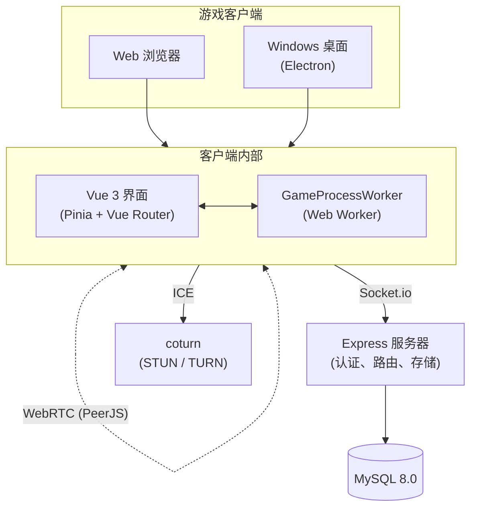

> 本仓库的游戏核心 fork from [FatPaper-1874/mine-monopoly](https://github.com/FatPaper-1874/mine-monopoly)。当前已迁移上游 `main`（`b5f2138`）的核心更新，并在此基础上保留本仓库的 AI 自动对局扩展。

<div align="center">


# MineMonopoly

**支持自定义地图的多人在线大富翁游戏**

目前支持 Web 浏览器、Windows平台

[](LICENSE) [](https://pnpm.io/) [](https://nodejs.org/) [](https://www.typescriptlang.org/) [](https://vuejs.org/) [](https://github.com/FatPaper-1874/mine-monopoly/releases)

</div>

<div align="center">

</div>

---

<div align="center">
  <a href="#特性"><b>✨ 特性</b></a> | <a href="#架构"><b>🏗️ 架构</b></a> | <a href="#文档"><b>📄 文档</b></a> | <a href="#常见问题"><b>❓ 常见问题</b></a> |
  <a href="#支持"><b style="color:#FFD700">☕ 支持作者</b></a>
</div>

---

## 简介

**MineMonopoly** 是一款支持**自定义地图**的多人在线大富翁游戏，内置功能完整的**地图编辑器**。拖拽式可视化界面让你可以自由绘制棋盘、配置地块、编写事件逻辑，用 TypeScript / JavaScript 写**自定义玩法**——每张地图都是独一无二的。

编辑器覆盖了游戏内容的方方面面：**角色**（技能与属性）、**机会卡**（可编程效果）、**地图事件**（触发条件与奖惩）、**游戏阶段**（回合规则），全部可配置。做好的地图可以在房间中和朋友一起玩。

编辑器还内置了 **MCP 服务**，支持 **AI 辅助编辑**——你可以用自然语言描述想要的游戏内容，AI 会自动生成对应的角色、卡牌、事件或修饰器代码，通过 TypeScript 类型校验后直接写入地图，大幅降低自定义玩法的门槛。

游戏采用**混合 P2P 设计**——中央服务器负责认证和房间路由，游戏逻辑在主机客户端的 **Web Worker** 中独立运行，玩家之间通过 **WebRTC (PeerJS)** 直连，延迟更低。

## 截图

<div align="center">


<p><em>游戏中</em></p>


<p><em>地图编辑器</em></p>

</div>

## 特性

### 地图编辑器

- **可视化编辑** — 拖拽式创建地图，所见即所得
- **丰富的事件系统** — 配置触发器、条件判断、奖励与惩罚
- **角色与阶段配置** — 自定义角色属性和游戏阶段规则

### 混合 P2P 架构

- 中央服务器负责认证和房间匹配
- 游戏逻辑在独立 **Web Worker** 中运行，不阻塞 UI
- 玩家间 WebRTC 直连，低延迟同步
- **coturn** TURN/STUN 中继，保障复杂网络环境下的连通性

### 多平台支持

- Web 浏览器 — 打开即玩
- Windows 桌面端 — 原生 Electron 应用，支持自动更新
- 移动端 — 计划开发中

### 丰富游戏系统

- **角色系统** — 每个角色拥有独特的技能和修饰器
- **机会卡** — 使用 TypeScript 编写可编程卡牌效果
- **修饰器系统** — 灵活的增益/减益模板机制
- **游戏阶段** — 可配置的回合阶段与规则集
- **UI Schema** — 声明式 UI 描述系统

### AI 辅助编辑

- 地图编辑器内置 **MCP 服务**，支持 AI 辅助生成游戏内容
- AI Agent 可通过结构化工具批量生成角色、卡牌、事件和修饰器

## 架构



| 组件         | 技术栈                            | 作用                 |
| ------------ | --------------------------------- | -------------------- |
| 前端         | Vue 3 + TypeScript + Vite + Pinia | 界面、路由、状态管理 |
| 3D / 2D 渲染 | Three.js + GSAP                   | 游戏内容渲染、动画特效   |
| 桌面壳       | Electron                          | Windows 原生应用     |
| 后端         | Express + TypeORM + MySQL         | 认证、房间、地图存储 |
| P2P 通信     | PeerJS (WebRTC) + coturn          | 玩家间数据通道       |
| 序列化       | Protocol Buffers                  | 地图数据编码         |
| 仓库管理     | pnpm workspaces + Changesets      | 依赖与版本管理       |

```
mine-monopoly/
├── apps/
│   ├── client/         # 游戏客户端 (Vue 3 + Electron)
│   ├── server/         # 游戏服务器 (Express + TypeORM + MySQL)
│   ├── admin/          # 管理后台
│   └── map-editor/     # 地图编辑器 (Electron + MCP 服务)
├── packages/
│   ├── types/          # 共享类型定义
│   ├── env/            # 环境变量管理
│   ├── utils/          # 共享工具与 protobuf
│   ├── components/     # 共享 Vue 组件
│   └── style/          # 共享 SCSS 样式
├── docker/             # Docker 部署
├── docs/               # 项目文档与 AI-live 改造记录
├── tools/ai-live/      # AI 自动房间、bot-runner 和运行报告
└── conf/               # MySQL 配置
```

## 快速开始

### 环境要求

- **Node.js** 20+
- **pnpm** 10.10.0+
- **MySQL** 8.0+

### 安装

```bash
# 克隆本仓库
git clone https://github.com/susyimes/mine-monopoly-ai-live.git
cd mine-monopoly-ai-live

# 安装依赖
pnpm install

# 配置环境变量
cp .env.example .env
# 编辑 .env 文件，配置数据库等信息
```

### 开发

```bash
pnpm dev-client    # 游戏客户端 → http://localhost:5173
pnpm dev-server    # 游戏服务器
pnpm dev-editor    # 地图编辑器
pnpm dev-admin     # 管理后台
```

### 构建

```bash
pnpm build-client       # 构建客户端
pnpm build-editor       # 构建地图编辑器
pnpm build-server       # 构建服务器
```

构建产物在各应用的 `dist/` 目录中。

### 类型检查

```bash
pnpm check-all          # 全量类型检查（客户端 + 编辑器）
pnpm check-client       # 仅客户端
pnpm check-editor       # 仅编辑器
```

## AI 自动对局扩展

本仓库额外保留 `tools/ai-live`，用于自动创建房间、驱动 bot 玩家、运行规则/Mimo 策略、记录结构化事件和生成运行报告。客户端在 `?automation=1` 下会暴露 `window.__AI_LIVE_CLIENT_BRIDGE__`，供工具触发投骰、确认弹窗、机会卡、动态按钮和动画完成等真实客户端动作。

```powershell
cd D:\mine-monopoly-ai-live\tools\ai-live
npm install
npm run stack:check
npm run test:build-house
npm run run:rules -- --room ai001 --bots 4 --humans 0 --headful=false --round-time 8 --client-url http://localhost:5173
npm run report:last
```

## 环境变量

### 通用

| 变量              | 说明                    | 默认值        |
| ----------------- | ----------------------- | ------------- |
| `NODE_ENV`        | 运行环境                | `development` |
| `MONOPOLY_DOMAIN` | 服务器域名              | `localhost`   |
| `PROTOCOL`        | 协议 (`http` / `https`) | `http`        |

### 服务端口

| 变量                  | 说明         | 默认值 |
| --------------------- | ------------ | ------ |
| `SERVER_PORT`         | 主服务器端口 | `8181` |
| `ICE_SERVER_PORT`     | ICE 信令端口 | `8182` |
| `MONOPOLY_ADMIN_PORT` | 管理后台端口 | `8183` |

### 路径前缀（nginx 反向代理）

| 变量                | 说明                                         |
| ------------------- | -------------------------------------------- |
| `API_BASE_PREFIX`   | API 路径前缀（留空使用端口模式）             |
| `ICE_BASE_PREFIX`   | ICE 路径前缀（留空跟随 API_BASE_PREFIX）     |
| `ADMIN_BASE_PREFIX` | 管理后台路径前缀（留空跟随 API_BASE_PREFIX） |

### 数据库

| 变量             | 说明       | 默认值      |
| ---------------- | ---------- | ----------- |
| `MYSQL_HOST`     | 数据库地址 | `localhost` |
| `MYSQL_PORT`     | 数据库端口 | `3307`      |
| `MYSQL_DATABASE` | 数据库名   | `monopoly`  |
| `MYSQL_USERNAME` | 数据库用户 | `root`      |
| `MYSQL_PASSWORD` | 数据库密码 | `root`      |

### TURN / STUN（WebRTC）

| 变量                 | 说明                       |
| -------------------- | -------------------------- |
| `TURN_SECRET`        | TURN 服务器密钥            |
| `TURN_TTL`           | TURN 凭证有效期（秒）      |
| `TURN_URL`           | TURN 服务器地址            |
| `TURN_PORT`          | TURN TLS 端口              |
| `STUN_PORT`          | STUN 端口                  |
| `COTURN_METRICS_URL` | coturn Prometheus 指标地址 |

### 可选：云存储（腾讯云 COS）

| 变量             | 说明             |
| ---------------- | ---------------- |
| `TC_ID`          | 腾讯云 SecretId  |
| `TC_KEY`         | 腾讯云 SecretKey |
| `TC_BUCKET_NAME` | COS 存储桶名称   |
| `TC_REGION`      | COS 区域         |

如不配置，文件将存储在 `apps/server/public/` 本地目录。

### 文件存储路径

| 变量                    | 说明             |
| ----------------------- | ---------------- |
| `AVATAR_STORAGE_PATH`   | 用户头像上传路径 |
| `GAME_MAP_STORAGE_PATH` | 游戏地图存储路径 |

### 加密

| 变量              | 说明                                 |
| ----------------- | ------------------------------------ |
| `MAP_ENCRYPT_KEY` | 地图文件加密密钥（16 位 ASCII 字符） |

## Docker 部署服务器

### 前提条件

- Docker 与 Docker Compose

### 部署步骤

```bash
# 1. 克隆本仓库
git clone https://github.com/susyimes/mine-monopoly-ai-live.git
cd mine-monopoly-ai-live

# 2. 配置环境
cp docker/.env.example docker/.env
# 编辑 docker/.env 填入配置

# 3. 创建外部网络
docker network create monopoly-network

# 4. 启动服务
docker compose -f docker/docker-compose.yml up -d
```

### 服务

| 服务            | 容器               | 端口                              |
| --------------- | ------------------ | --------------------------------- |
| fatpaper-mysql  | MySQL 8            | 3307 -> 3306（宿主机 -> 容器）    |
| monopoly-server | Express 应用服务器 | 8181, 8182, 8183（可配置）        |
| monopoly-coturn | STUN/TURN 中继     | 3478 (STUN), 5349 (TURN TLS)      |

服务器通过外部 Docker 网络 (`monopoly-network`) 与随 compose 启动的 MySQL 通信。若需要连接已有 MySQL，可在 `docker/.env` 中覆盖 `MYSQL_HOST` / `MYSQL_PORT` 并移除或停用 `fatpaper-mysql` 服务。

## 文档

| 文档                                          | 说明                         |
| --------------------------------------------- | ---------------------------- |
| [开发指南](docs/development-guide.md)         | 架构设计、核心概念、编码规范 |
| [游戏进程 API](docs/game-process-api.md)      | effectCode 公开 API 参考     |
| [修饰器系统 API](docs/api/modifier-system.md) | 修饰器模板用法与迁移指南     |
| [AI 地产棋局改造方案](docs/ai-live-remodel-plan.md) | 本仓库 AI-live 改造规划 |
| [Agent 群落运行时](docs/agent-colony-runtime.md) | AI-live agent 运行时说明 |
| [minev2 AI Live 运行记录](docs/ai-live-minev2-runbook.md) | 新版基线 4 bot / Mimo 跑局记录 |
| [任务索引](docs/tasks/README.md) | 本仓库阶段任务记录 |

## 贡献

欢迎贡献想法、代码！

1. 阅读 [CONTRIBUTING.md](CONTRIBUTING.md) 了解开发环境搭建和规范
2. 查看 [开发指南](docs/development-guide.md) 了解编码标准
3. 在 [Issues](https://github.com/FatPaper-1874/mine-monopoly/issues) 中认领任务或提出新功能建议
4. Fork、创建分支、提交代码、发起 Pull Request

也欢迎通过 Issue 模板提交 Bug 报告和功能建议。

## 常见问题

**Q: 可以自行部署吗？**
可以。推荐使用 [Docker 部署](#docker-部署)，也可以直接运行服务器连接本地 MySQL。

**Q: 如何创建自定义地图？**
使用地图编辑器（`pnpm dev-editor`），提供可视化拖拽编辑界面。详见 [开发指南](docs/development-guide.md)。

**Q: P2P 架构是如何工作的？**
主机客户端在 Web Worker 中运行游戏逻辑，其他玩家通过 WebRTC 数据通道直连主机。中央服务器负责认证和房间路由，coturn 提供 STUN/TURN 中继解决 NAT 穿透问题。

**Q: 支持哪些平台？**
游戏客户端：Web 浏览器、Windows。地图编辑器：Windows。

**Q: 可以自定义角色、卡牌和事件吗？**
可以。所有游戏内容均通过地图编辑器的 TypeScript effectCode 定义。详见 [游戏进程 API](docs/game-process-api.md)。

**Q: 没有 TURN 服务器能玩吗？**
局域网环境下 WebRTC 通常可以建立直连。跨 NAT 场景需要 TURN 服务器中继。Docker 部署已包含预配置的 coturn。

## ⭐ Star History

<div align="center">

[](https://star-history.com/#FatPaper-1874/mine-monopoly&Date)

</div>

## 支持

如果觉得 MineMonopoly 好玩或者对你有帮助，欢迎请作者喝杯咖啡 ☕

<div align="center">


</div>

## 致谢

- 客户端字体：[Resource Han Rounded](https://github.com/CyanoHao/Resource-Han-Rounded)

## 许可证

本项目基于 **GNU General Public License v3.0** 许可证开源，详见 [LICENSE](LICENSE)。
